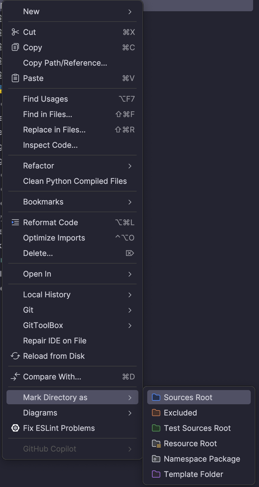

# FastAPI boilerplate with TortoiseORM

## Usage
You should install cookiecutter first:

```bash
pip install "cookiecutter>=1.7.0"
```

To create new project use this command

```bash
cookiecutter https://github.com/Afaneor/fastapi-docker-boilerplate
```
Then create `.env` file with
```bash
cp .env.example .env
```

Don't forget to mark app folder as source in pycharm


start db in docker
```bash
docker-compose up -d postgres
```

then execute the following commands, to initialize migrations
```bash
aerich init
```

## FAQ
### Model is not reflected in the migration
You should add Model to `__init__.py` in app/models

### How to create a new migration?
```bash
aerich migrate
```


## Included
* FastAPI
* Sample endpoint
* TortoiseORM
* Sample Test
* ~~Flake8 & Isort~~ ruff